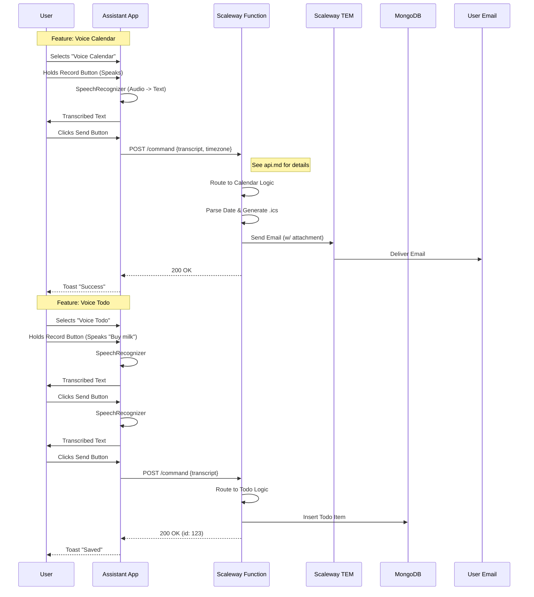

# Design Document: Personal Assistant Architecture

## 1. System Architecture
The system follows a **Client-Serverless** architecture designed for extensibility. The mobile app acts as the client for multiple "Skills", starting with the **Voice Calendar** skill.

## 2. Key Components

### 2.1 Mobile Application (Android)
*   **Modular Design:** The app is built to support multiple features.
*   **Voice Input:** Centralized voice capture component usable by different skills.
*   **Networking:** Shared API client for backend communication.

### 2.2 Backend (Scaleway Serverless)
*   **Function Endpoint:** Single entry point for assistant requests.
*   **Scaleway Functions:** Python function hosting logic for Voice Calendar and Voice Todo.
*   **Persistence (MongoDB):** Managed Document Store for Todo items and other state.

## 3. Data Flow

### 3.1 Voice Calendar
1.  **Capture:** User speaks commands/meeting details.
2.  **Transcribe:** Device converts speech to text.
3.  **Process:** Backend interprets text to extract structured data (Date, Time, Topic).
4.  **Action:** Backend executes the action (Sending Email Invite).

### 3.2 Voice Todo
1.  **Capture:** User speaks task.
2.  **Transcribe:** Device converts speech to text.
3.  **Process:** Backend interprets text (extracts priority, tags).
4.  **Action:** Backend saves the item to MongoDB.